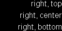
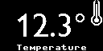

# Packed Font
## Memory efficient MicroPython fonts for the Pico Pi and SSD1306 OLED Display

MicroPython comes with an 8 x 8 pixel font which allows for a surprising amount of text to be displayed on the tiny OLED display. However the font is very small, especially for those of us getting older.  

A _Packed Font_ has the following features:

  * Uses a binary format to encode font data in a memory efficent manner.
  * When creating a _Packed Font_ you can select just the characters you need for your application, further saving on memory. 
  * Supports proportional width fonts (i.e. each character can have a different width) which is more appropriate for larger fonts.
  * Can be used to store icons as well as characters.
  * Can be loaded/unloaded at runtime. You don't need to build a new version of MicroPython from source to add a new font.

## Quick Start

There is an example application in the `./display/` folder which you can copy to your Pico Pi and run using Thonny. It runs through a few different examples of rendering text and icons.


|  |
|:--:|
|*128 Pixel Icon and 16 Pixel Font*|

The above screen is rendered as follows:

```python
from enhanced_display import Enhanced_Display

if __name__ == "__main__":

    display = Enhanced_Display()

    # Load the list of fonts to use
    display.load_fonts(['digits-30', 'text-16', 'icons-32', 'icons-128'])

    # Display the Welcome screen
    display.fill(0)                         # Clear the screen

    display.select_font('icons-128')
    display.text('s', 0, 0)                 # The 's' character is the Star icon
    display.select_font('text-16')
    display.text('Welcome', 0, 0, 1, 1)     # Center the text both horizontally and vertically.

    display.save_screenshot("title.bmp")    # Take a screenshot and save to file.

    display.show()
```
  

|  |
|:--:|
|*16 Pixel Text Font right-aligned*|
  
The above is rendered as follows:

```python
    # Display the right aligned text screen
    display.fill(0)

    display.text('right, top', 0, 0, 2, 0)
    display.text('right, center', 0, 0, 2, 1)
    display.text('right, bottom', 0, 0, 2, 2)

    display.show()
```

|  |
|:--:|
|*30 Pixel Digits Font, 8 Pixel Built in Font and 32 Pixel Icon*|

The above screen is rendered as follows:

```python
    # Display the Temperature screen
    display.fill(0)

    display.select_font('digits-30')
    degrees = '\u00b0'  # Character code for the degrees symbol
    display.text(f'12.3{degrees}', 0, 0, 1, 1)
    display.select_font('icons-32')
    display.text('t', 0, 0, 2)          # The 't' character contains the temperature icon
    display.select_font(None)           # Select the built in 8 pixel font
    display.text('Temperature', 0, 0, 1, 2)

    display.show()
```

If you haven't programmed your Pico Pi using Thonny before, here is a great article to get you started.

[How to setup a Raspberry Pi Pico and Code with Thonny](https://core-electronics.com.au/guides/how-to-setup-a-raspberry-pi-pico-and-code-with-thonny/)


## Example Fonts

There are two example fonts available for immediate use:

  1. A 'text-16.pf' font based on the Arial font with characters in the ASCII range 32-126.
  2. A 'digits-30.pf' font based on the GillSansNova font containing the digits 0-9, the minus symbol and the degrees symbol.

To use these in your application, you will need the following files from the `./display/` folder:

  * `digits-30.pf`
  * `enhanced_display.py`
  * `packed_font.py`
  * `text-16.pf`
  * `PiicoDev_SSD1306.py` 
  * `PiicoDev_Unified.py` 

Have a look at `main.py` for examples on how to load, select and render packed fonts.

## Enhanced Display Class

The easiest way to use packed fonts on the SSD1306 OLED Display, is to use the `Enhanced Display` class. This class has the same interface as the PiicoDev_SSD1306 class but has the following additional features:

  * Render aligned text using packed fonts and the built in 8 x 8 pixel font.
  * Detects if a display is present and performs NOPs if not present (i.e. code will still run without a display connected).
  * Take a screenshot of the display and save it to a .bmp file.

## Creating your own Fonts

It's easy to create custom fonts for use in your own applications. The advantage of creating your own fonts is you can choose just the characters you need. There are two Python scripts in the `create/` folder used for this purpose. Note that both require the Python Image Processing Library [Pillow (PIL) library](https://pillow.readthedocs.io/en/stable/index.html) to be installed.

Creating a font from an existing TrueType font on your PC is a two step process.

1. Run the `create-font.py` script to convert a TrueType font into a font definition file (`font_name.json`) and a series of bitmaps (1 per character).
2. Run the `pack-font.py` script to convert the font definition file and character bitmaps into a single `font_name.pf` packed font file. You can then copy the packed font file onto your Pico Pi for use in your application.

There are some example PowerShell scripts in the `create/` folder which were used to create the example packed fonts used by the example application.

#### Notes

* If you want to create a packed font from a series of icons, you would create the font definition file and icon bitmaps by hand. You can then use the `pack-font.py` command to convert them into a single `font_name.pf` packed font file.
* In the font definition file (`font_name.json`), you must specify a `DefaultCharacter` within your font. This character will be used when rendering any character that's not included in the font.
* When creating a font of a particular size, you normally aim for a font that has a height no larger than a certain target (e.g. 16 pixels high). You can adjust the font size argument you pass to `create-font.py` to maximize the size of the font while still meeting this target. For example if you are only using digits or capital letters, you don't need to allow space for descenders (e.g. y, j, g, etc) and can probably render an 18-20 pixel font within this size.
* If you create a font with both descenders and superscripts, `create-font.py` may shift the superscripts down a few pixels to fit within the target height.
* It's worth reviewing each character bitmap generated by `create-font.py` to make sure each character in the font has not been incorrectly cropped.
* Some characters such as 'y', 'v' and 'j' can have their left side cropped by a pixel or two. If you notice this is occurring, you can use the `--xoffsets` parameter to `create-font.py` to specify an xoffset adjustment for individual characters (see `create-text-16.ps1` for an example).
